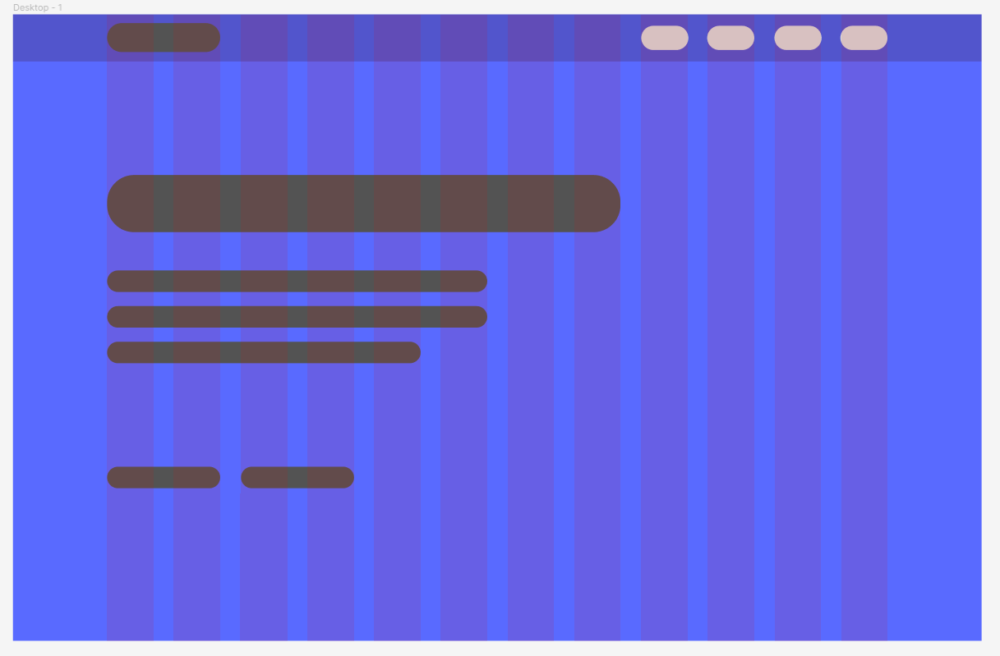
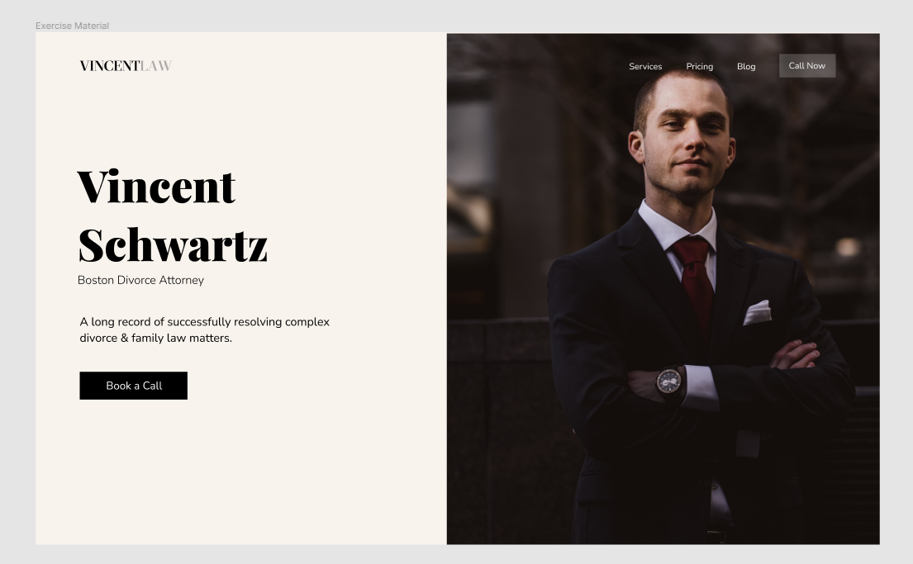
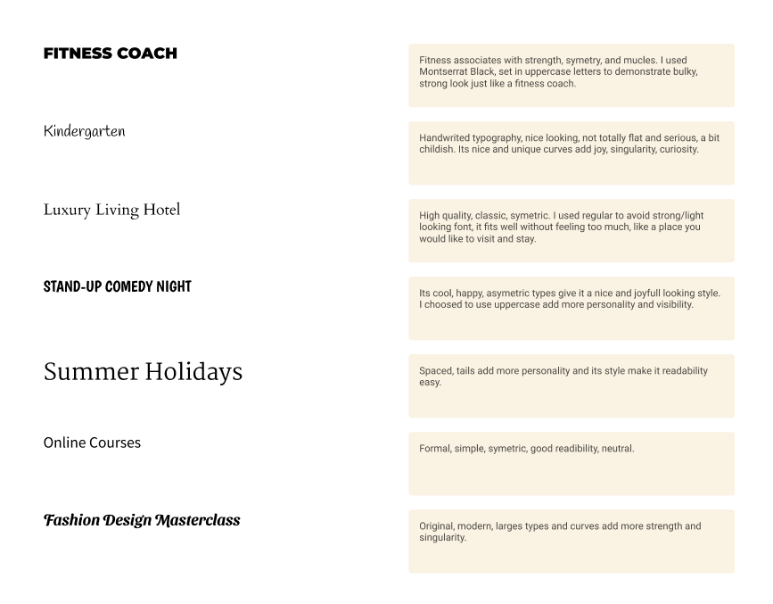
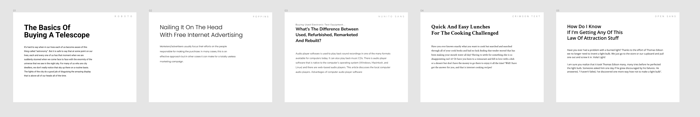
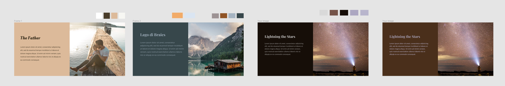

## Design Course

<details>
<summary>Webflow</summary>

```js
// No code website builder
```

</details>

<details>
<summary>Figma</summary>

```js
// new > Frame > Desktop > Layout Grid
```

</details>

## Layout

<details>
<summary>Layout</summary>

```js
// Alignment & Grid
// !Optical illusion (size)
// Proximity
```

<details>
<summary>Hierarchy using Grid</summary>



</details>

<details>
<summary>Hierarchy Sample</summary>



</details>

</details>

## Typography

<details>
<summary>Typography</summary>

<details>
<summary>Example</summary>

<details>
<summary>Type Choice</summary>



</details>

<details>
<summary>Type Hierarchy</summary>



</details>

</details>

## Typography basics

<details>
<summary>Basics</summary>

```js
// Typeface : original font name
// font: type of font : regular, light

// --
// serif : extra "tails"
// sans serif: without serif
// --
// display: decorative
// --
// script
```

<details>
<summary>Serif</summary>

```js
// Oldstyle
// Modern
// Slab
```

oldstyle

```js
// classic
// most book use it

// font: Baskerville, Garamond, Palatino
```

modern

```js
// can be similar to oldstyle
// tails are differents: flat tails(modern)
// thick and thin letters
// fashion, luxury

// => headline, big text
// avoid using it for paragraph and long text, because its low readability

// font: Onyx, Bodoni, Didot
```

slab

```js
// boxy, no thick/thin contrast

// => mecanical, strong
// => headline, big text

// font: Rockwell, Josefin slab, Roboto slab
```

</details>

<details>
<summary>Sans Serif</summary>

```js
// main type, most versatile, fit wide range of personality
// modern, serious, neutral

// font: Helvetica, Arial, Open Sans
```

styles

```js
// Grotesque
// Geometric
// Humanistic
```

</details>

<details>
<summary>Display</summary>

```js
// strongest personality

// => big headline
// avoid for paragraph

// font: Braggadocio, Chalkduster, Metropolis
```

</details>

<details>
<summary>Script</summary>

```js
// based on handwriting,
// good usecase, design, personality

// => big headline
// avoid for paragraph

// styles: Formal, Casual
// font: Edwardian script, brush script, quickly
```

</details>

<details>
<summary>Setting Type - Letter spacing</summary>

```js
// large space => add more strentgh
// thight space => when large bold type are too big, keep text more compact

//- make text more readable
// - achieve a good text hierarchy
```

</details>

```js
// Two fonts rule

// Big text - Headline => Unique font
// Paragraph => more readable font, sans-serif

// Open Sans - Roboto => Commonly used
```

</details>

</details>

## Colors

<details>
<summary>Colors</summary>

<details>
<summary>Colors study example</summary>



</details>

Sampling Colors

```js
// Canva > set Img Blur > Pick mains colors > Add to Typography
```

Fine-Tuning colors

```js
// ForEach MainsColors
// Set Color to HSB: Hue - Saturation - Brightness
// Set more vivd color: Add more Brightness(forExample: by 10) - Decrease saturation a little bit
```

Color hunting

```js
// - directly copying => dribble - awwwards

// - use coolors.co
// avoid raw colors

// if (logo) use BrandColor === client paid for it
// if (!logo) try to set your own color
// if (color are junks) use more neutral color: white, grey, black
```

</details>
